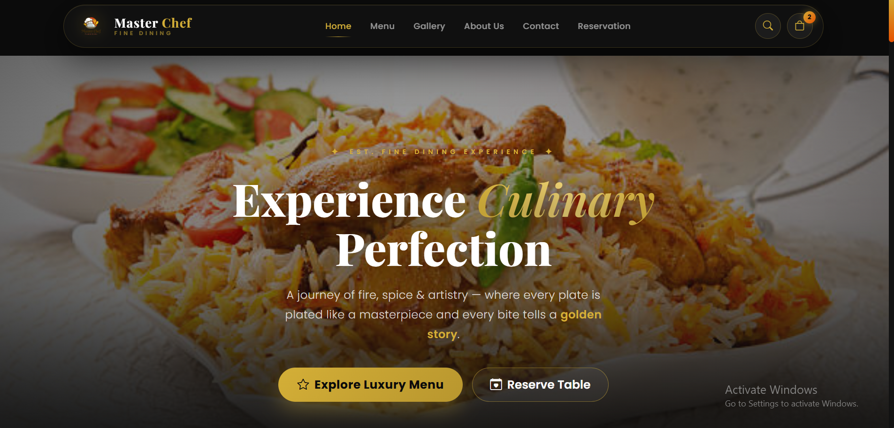
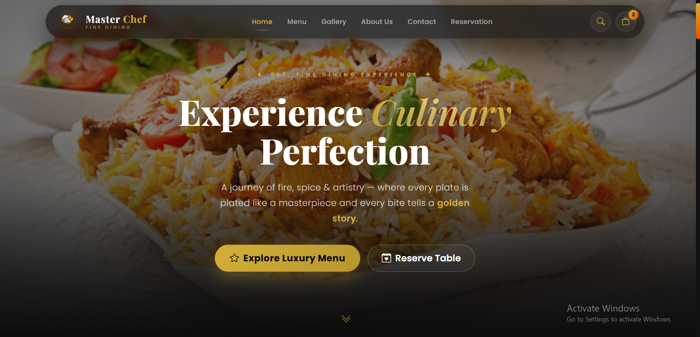

# Master Chef — Luxury Fine Dining

A high-end, fully responsive multi-page restaurant website with a cinematic luxury dark theme. Built with pure **HTML5**, **CSS3**, **Bootstrap 5**, and vanilla **JavaScript** — no frameworks, no build steps, zero dependencies.

> [Live Demo](https://your-domain.example) &nbsp;·&nbsp; [Gallery Screenshot](Screenshots/bb.png) &nbsp;·&nbsp; [Banner Screenshot](Screenshots/banner.png)



---

## Table of Contents

- [About the Project](#about-the-project)
- [Pages](#pages)
- [Key Features](#key-features)
- [Design System](#design-system)
- [Project Structure](#project-structure)
- [Technologies Used](#technologies-used)
- [Getting Started](#getting-started)
- [Screenshots](#screenshots)
- [Customization Guide](#customization-guide)
- [Our Team](#our-team)
- [License](#license)

---

## About the Project

**Master Chef** is a complete restaurant website designed for a premium fine-dining brand. Every page carries a consistent obsidian-black, metallic-gold aesthetic — from the glassmorphism navbar and cinematic hero down to the masonry gallery and a full-width food video that plays right on the home page.

It is not a template dump: the site ships with a working **cart system**, **live menu search & filters**, a **gallery lightbox**, a **table reservation flow**, and **form feedback** — all in plain JavaScript with `localStorage` persistence.

---

## Pages

| Page | File | What's inside |
|------|------|----------------|
| **Home** | `index.html` | Cinematic hero, filterable masonry gallery + lightbox, full-width video showcase with a play button, signature dishes, master chefs, testimonials, 20% offer strip |
| **Menu** | `menu.html` | 24 dishes across 4 categories (Fast Food, Traditional Cuisines, Drinks, Desserts), category filter tabs, live search box, "Add to Cart" on every card |
| **About** | `about.html` | Brand story + "Est. 2025" badge, animated journey timeline, hygiene & safety standards, team showcase |
| **Contact** | `contact.html` | Contact form with success feedback, info card (address / phone / email / hours), embedded map, newsletter signup |
| **Reservation** | `reservation.html` | Booking form with past-date blocking, live booking summary panel and validation |

---

## Key Features

- **5 connected pages** with a shared floating glass navbar and consistent luxury styling.
- **Sliding search bar** in the navbar that jumps to the menu page and pre-filters results live (`menu.html?q=...`).
- **Shopping cart** — drawer UI with quantity steppers, remove buttons, subtotal, animated gold counter badge, toast notifications, and `localStorage` persistence.
- **Menu filter tabs + live search** — type or click to instantly filter 24 dishes by category and name.
- **Masonry gallery** with category filters and a full-screen lightbox (click any image to preview it).
- **Video showcase** — plays `videos/food.mp4` **full-width on the page** with sound:
  - Ambient muted loop in the background (with a decorative animated plate).
  - Press the golden play button (or click anywhere on the banner) to play it full-width **with sound** and native controls.
  - Dedicated mute/unmute toggle button in the corner.
- **Reservation form** — selected date/time/guests/seating update a live booking summary; past dates are blocked.
- **Contact + newsletter forms** with instant success / error feedback.
- **Scroll-reveal animations** via `IntersectionObserver` and an animated **back-to-top** button.
- **Responsive** on mobile, tablet, and desktop; reduced-motion support built in.

---

## Design System

| Token | Value | Usage |
|-------|-------|-------|
| Ultra matte black | `#0B0B0B` / `#121212` | Page backgrounds |
| Deep obsidian | `#181818` / `#1F1F1F` | Cards & surfaces |
| Metallic Gold | `#D4AF37` | Primary accent, buttons, highlights |
| Warm Saffron | `#E65100` | Secondary accent, gradients |
| Pure White | `#FFFFFF` | Headings & key text |

**Typography:** Playfair Display (serif) for headings — Poppins (sans) for body and UI.

**Signature details:** glassmorphism navbar (`backdrop-filter: blur(12px)`), golden glows, hover-zoom imagery, deep drop-shadows, 50px pill buttons, and a 24px border-radius card language.

---

## Project Structure

```text
food_website/
├── index.html            # Home — hero, gallery, video, dishes, chefs, reviews
├── menu.html             # Menu — 24 dishes, filter tabs, live search, cart
├── about.html            # Story timeline, standards, team
├── contact.html          # Contact form, info card, embedded map
├── reservation.html      # Table booking + live summary
├── css/
│   └── style.css         # Full luxury theme (design tokens, all pages)
├── js/
│   └── main.js           # All interactivity (cart, filters, gallery, video, forms)
├── videos/
│   └── food.mp4          # Food video — plays full-width on the home page
├── Screenshots/
│   ├── bb.png            # Full-page preview
│   └── banner.png        # Banner preview
└── images/               # All local assets
    ├── logo.png          # Navbar / footer logo
    ├── hero-bg.jpg       # Hero background
    ├── dish1.jpg … dish8.jpg
    ├── gallery-1.jpg … gallery-8.jpg
    ├── chef1.svg, chef2.svg, chef3.svg
    ├── avatar1.svg, avatar2.svg, avatar3.svg
    └── drinks & desserts… (lassi, dessert-cake, gulab-jamun, etc.)
```

---

## Technologies Used

| Technology | Purpose |
|------------|---------|
| **HTML5** | Semantic, accessible page structure |
| **CSS3** | Luxury design system built on CSS variables |
| **Bootstrap 5.3** | Responsive grid, nav, utility classes |
| **Bootstrap Icons** | Icon set used across the UI |
| **Vanilla JavaScript** | Cart, filters, gallery lightbox, video player, forms, animations |
| **Google Fonts** | Playfair Display + Poppins |

No package manager, no build tools, no backend — open it and it works.

---

## Getting Started

1. **Download** or clone the project folder.
2. **Open** `index.html` in any modern browser (Chrome, Firefox, Edge, Safari).
3. Browse all 5 pages via the navbar.

That's it — no install, no server, no build step required.

> Tip: serve the folder with any static server (**VS Code Live Server**, `python -m http.server`) if your browser blocks local video playback or you want to test with the map embed.

---

## Screenshots

**Home — cinematic hero & luxury navbar**



**Full-page preview**


---

## Customization Guide

- **Replace the food video** — drop your file at `videos/food.mp4` (keep the same name/path).
- **Swap dish images** — replace any file in `images/` (e.g. `dish1.jpg`, `gallery-1.jpg`). Paths stay the same, nothing else to update.
- **Swap chef / testimonial avatars** — the SVG placeholders in `images/` can be replaced with real photos (`.jpg`/`.png`) without touching HTML.
- **Change the brand colors** — edit the CSS variables at the top of `css/style.css` (`--gold`, `--bg-0`, `--saffron`, …).
- **Add a dish** — copy a `.menu-card` block in `menu.html` and set its `data-category`; name it anywhere in the card text for search to pick it up.
- **Update contact details** — edit the info rows and footer in `contact.html` / shared footers.

---

## Our Team

| Name | Role |
|------|------|
| **Chef Tariq Mahmood** | Head Chef |
| **Chef Ayesha Khan** | Pastry Specialist |
| **Chef Bilal Ahmed** | Grill Master |
| **Asad Malik** | Restaurant Manager |
| **Fatima Zahra** | Customer Experience Lead |
| **Usman Ali** | Logistics & Delivery Head |

---

## License

Project created for educational and demo purposes. All dish names, recipes and the food imagery are illustrative; feel free to use, modify, and learn from the code.

**Master Chef — Luxury Fine Dining &nbsp;·&nbsp; 2026**